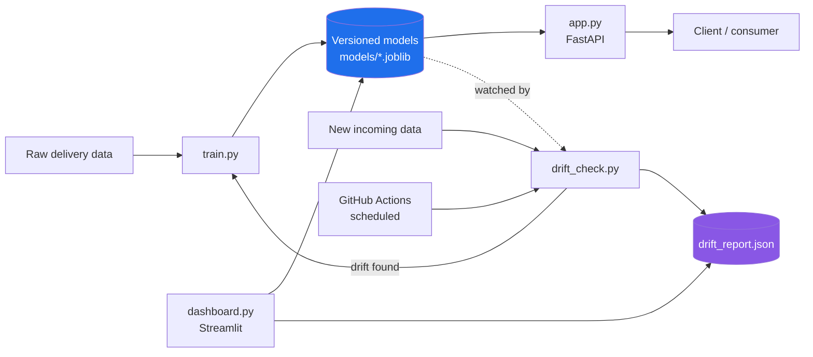

# 📦 Delivery Time Predictor — An End-to-End MLOps Pipeline


A machine learning pipeline that predicts delivery times, serves
predictions through an API, **detects when its own assumptions have
gone stale**, and retrains itself automatically. Built to demonstrate
the full lifecycle of a production ML system — not just a model in a
notebook.

> New to this project or to MLOps? See **[TUTORIAL.md](TUTORIAL.md)**
> for a plain-language, step-by-step walkthrough of every command.
> This README is the technical overview.

---

## Why this project exists

Most ML portfolio projects stop at "here's my model's accuracy."
In production, a model's accuracy quietly decays as the real world
changes — a phenomenon called **data drift** or **model decay**. This
project demonstrates the part of the job that actually matters after
deployment: noticing decay and responding to it, automatically.

## Architecture



**The loop that matters:** new data arrives → `drift_check.py` tests
it statistically against the training data → if it's meaningfully
different, `train.py` runs again → a new model version is saved,
never overwriting the old one. This is the same feedback loop real
MLOps systems run in production, just scoped down to something you
can run on a laptop in an afternoon.

## Features

| Capability | File | What it demonstrates |
|---|---|---|
| Model training with versioning | `train.py` | Never lose a working model when training a new one |
| REST API serving | `app.py` | Deploying a model, not just training one |
| Statistical drift detection | `drift_check.py` | Recognizing when a model's assumptions are stale |
| Visual monitoring dashboard | `dashboard.py` | Making pipeline health legible to humans |
| Unified CLI | `control.py` | One entry point, config-driven, extensible |
| Automated retraining | `.github/workflows/retrain.yml` | CI/CD applied to ML, not just code |
| Test suite | `tests/` | Verifying pipeline correctness, not eyeballing it |
| Containerization | `Dockerfile` | Reproducible deployment anywhere |

## Quick start

```bash
pip install -r requirements.txt
python3 control.py generate-data
python3 control.py train
python3 control.py check-drift
python3 control.py serve          # API at http://127.0.0.1:8000/docs
python3 control.py dashboard      # dashboard at http://localhost:8501
python3 control.py test           # run the test suite
```

Every command above also has a plain-language explanation in
[TUTORIAL.md](TUTORIAL.md) if any step is unclear.

## Project structure

```
mlops-demo/
├── control.py            # single CLI entry point — start here
├── config.json            # all settings (paths, features, thresholds)
├── config.py               # loads config.json for every module
├── train.py                 # trains and versions models
├── app.py                    # FastAPI serving layer
├── drift_check.py             # statistical drift detection
├── dashboard.py                 # Streamlit monitoring UI
├── data/
│   └── make_data.py               # generates practice data
├── tests/
│   ├── test_train.py                # training pipeline tests
│   └── test_drift.py                 # drift detection tests
├── models/                            # versioned model artifacts (gitignored)
├── .github/workflows/retrain.yml       # scheduled drift check + auto-retrain
├── Dockerfile
├── requirements.txt
└── TUTORIAL.md                          # beginner-friendly step-by-step guide
```

## Design decisions worth mentioning in an interview

- **Config-driven, not hardcoded.** Every script reads shared settings
  from `config.json` via `config.py`. Adding a new model feature means
  editing one list in one file, not hunting through four scripts.
- **Models are never overwritten.** Each training run gets a new
  version number (`model_v1`, `model_v2`, ...), so a bad retrain never
  destroys a working model — a rollback is just loading an older file.
- **Drift detection uses a real statistical test** (Kolmogorov–Smirnov),
  not an arbitrary heuristic, to decide whether incoming data has
  actually shifted.
- **The pipeline is idempotent by design:** `control.py pipeline` only
  retrains when drift is actually detected, rather than retraining on
  every run regardless of need.

## Possible extensions

- Swap the synthetic dataset for a real one (Kaggle, a public API)
- Add a check that a new model must beat the old one's accuracy before
  being promoted (a hook for this exists in `train.py`)
- Deploy the Docker container to a free host (Render, Railway) for a
  live public URL
- Replace the KS-test drift check with population stability index (PSI)
  for a second, complementary drift signal

## License

MIT — see [LICENSE](LICENSE).
